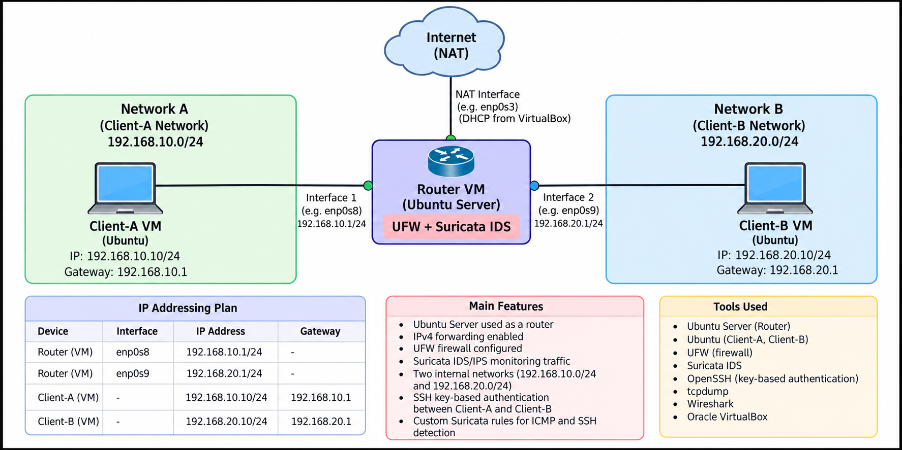

# Linux Network Monitoring & Security Lab

A hands-on network security lab built with Ubuntu Server, VirtualBox, UFW, tcpdump, Wireshark, and Suricata.

This project explores how network traffic moves between separate subnets, how a Linux router controls that traffic, and how packet analysis and intrusion detection can be used to monitor network activity.

The lab was built to practice networking and Linux administration from a security perspective, using a controlled virtual environment rather than physical networking hardware.

---

## Table of Contents

- [Project Overview](#project-overview)
- [Objectives](#objectives)
- [Network Architecture](#network-architecture)
- [Why These Tools?](#why-these-tools)
- [Implementation](#implementation)
- [Security Configuration](#security-configuration)
- [Traffic Monitoring and Detection](#traffic-monitoring-and-detection)
- [Custom Suricata Rules](#custom-suricata-rules)
- [Testing and Results](#testing-and-results)
- [Repository Structure](#repository-structure)
- [Limitations and Future Improvements](#limitations-and-future-improvements)
- [Key Learnings](#key-learnings)

## Project Overview

The lab consists of two client networks connected through an Ubuntu Server router. Traffic between the networks passes through the router, allowing routing behavior and firewall policies to be tested in one environment.

Packet captures are inspected with Wireshark, while Suricata monitors traffic and generates alerts when packets match custom detection rules.

The main idea is to connect three practical areas of network security:

1. **Traffic control** — route traffic between networks and restrict it with firewall rules.
2. **Traffic visibility** — capture packets and understand what communication is occurring.
3. **Traffic detection** — use Suricata signatures to identify selected network activity.

## Objectives

- Build an isolated, multi-subnet virtual network.
- Configure Linux IPv4 forwarding and routing.
- Control inter-network traffic using UFW.
- Harden SSH remote access with public-key authentication.
- Capture and inspect ICMP and TCP traffic.
- Configure Suricata and write custom detection rules.
- Validate the setup with repeatable tests and recorded evidence.
- Document the configuration and findings in a reproducible repository.

## Network Architecture



### Topology Design

The router has one interface connected to each internal network and a separate NAT interface for external connectivity.

| Component | Interface / Network | Address | Purpose |
|---|---|---|---|
| Ubuntu Router | Network A | `192.168.10.1/24` | Gateway for Client-A |
| Client-A | Network A | `192.168.10.10/24` | Generates test traffic |
| Ubuntu Router | Network B | `192.168.20.1/24` | Gateway for Client-B |
| Client-B | Network B | `192.168.20.10/24` | Receives traffic and provides SSH |
| Ubuntu Router | VirtualBox NAT | `10.0.2.15/24` | Router's external connectivity |

The router's internal interfaces are `enp0s8` for Network A and `enp0s9` for Network B. The NAT interface is `enp0s3` in the recorded configuration.

### How Traffic Flows

For example, when Client-A pings Client-B:

1. Client-A sends an ICMP Echo Request to `192.168.20.10`.
2. Because Client-B is on a different subnet, Client-A sends the packet to its default gateway, `192.168.10.1`.
3. The router forwards the packet through its Network B interface, subject to its routing and firewall configuration.
4. Client-B returns an ICMP Echo Reply through the router.
5. tcpdump and Wireshark can be used to inspect the packets, while Suricata can generate an alert if its configured rule matches the traffic.

This design makes the router a useful observation point for inter-subnet traffic.

## Why These Tools?

| Tool | Purpose in This Lab |
|---|---|
| VirtualBox | Creates isolated virtual machines and internal networks without physical hardware. |
| Ubuntu Server | Provides the router and client operating environments. |
| UFW | Manages firewall policies, including rules for forwarded traffic. |
| tcpdump | Captures packets directly from Linux network interfaces. |
| Wireshark | Displays packet headers, protocols, source and destination addresses, and ICMP request/reply details. |
| Suricata | Inspects traffic against detection rules and records matching alerts. |
| OpenSSH | Provides remote access for testing and SSH hardening. |

Each tool serves a different purpose: UFW controls traffic, tcpdump and Wireshark help investigate it, and Suricata detects selected patterns.

## Implementation

### 1. Virtual Network Setup

Created two separate VirtualBox internal networks and connected them through the Ubuntu router.

Static IP addresses were configured for the router's internal interfaces and both clients. Default gateways direct traffic to the router when the destination is outside a client's local subnet.

**Evidence:** [VirtualBox lab](screenshots/01-virtualbox-lab.png) · [Router interfaces](screenshots/02-router-interfaces.png)

### 2. IPv4 Forwarding and Routing

Enabled IPv4 forwarding on the router so it could pass packets between Network A and Network B.

Connectivity was checked by sending ICMP requests from Client-A to Client-B and observing the replies.

### 3. Firewall Configuration

Configured UFW on the router to control traffic entering the router and traffic being forwarded between networks.

A routed SSH rule was added to allow TCP port 22 from the Client-A subnet to the Client-B subnet. Testing firewall behavior helps demonstrate the difference between routing a packet and permitting that packet through a firewall.

**Evidence:** [UFW status](screenshots/03-firewall-status.png)

### 4. SSH Hardening

Configured the SSH server on Client-B to use public-key authentication and disabled password-based authentication and root login.

The tests included a key-based SSH login and an attempt to authenticate using passwords only. The password-only attempt was rejected, as expected with the configured policy.

**Evidence:** [SSH login test](screenshots/09-ssh-login.png) · [SSH hardening](screenshots/11-ssh-hardening.png)

### 5. Packet Capture and Analysis

Used tcpdump on the router to capture traffic, then saved the capture as a PCAP file for analysis in Wireshark.

The ICMP display filter `icmp` was used to focus on ping requests and replies. The filter `tcp.port == 22` can be used to inspect captured SSH traffic when such packets are present in the capture.

**Evidence:** [Wireshark ICMP analysis](screenshots/07-wireshark-icmp.png)

### 6. Suricata Configuration

Installed Suricata on the Ubuntu router, configured it to capture on the Network A interface (`enp0s8`), and added custom rules in `rules/local.rules`.

The rules were loaded and validated, and Suricata was started as a system service. Test traffic was then generated to confirm that matching alerts appeared in the Suricata fast log.

**Evidence:** [Suricata running](screenshots/04-suricata-running.png) · [Custom rules](screenshots/05-custom-rules.png) · [Suricata validation](screenshots/10-suricata-validation.png)

## Security Configuration

### Firewall Policy

The firewall controls which traffic is allowed to pass between the internal networks. The SSH route rule limits the intended service to TCP port 22 and traffic originating from the Client-A subnet.

### SSH Authentication

The SSH server on Client-B uses the following security settings:

```text
PubkeyAuthentication yes
PasswordAuthentication no
PermitRootLogin no
```

These settings require public-key authentication for normal SSH access and prohibit direct root login. SSH access also depends on the router's forwarding and firewall rules.

### Suricata Detection

The custom rules identify selected ICMP and SSH traffic. These are detection signatures, not a complete threat detection system: an alert indicates that traffic matched a rule, not that an attack or compromise has necessarily occurred.

## Custom Suricata Rules

The rules are stored in [`rules/local.rules`](rules/local.rules).

### ICMP Detection

The ICMP rule matches traffic from the Client-A subnet to the Client-B subnet. It is useful for demonstrating how a custom signature can identify a particular type and direction of network traffic.

### SSH Detection

The SSH rule matches TCP connection attempts targeting port 22 from Client-A's subnet to Client-B's subnet. It is useful for observing connection attempts, but it does not by itself identify malicious SSH authentication or prove that a login succeeded.

Suricata writes matching alerts to `fast.log`, which can be monitored while generating test traffic.

## Testing and Results

The lab was checked using connectivity tests, SSH authentication tests, packet captures, and Suricata alert logs.

| Test | Purpose |
|---|---|
| Router interface inspection | Verify interface addressing |
| IPv4 forwarding check | Confirm forwarding is enabled |
| ICMP ping | Test inter-subnet connectivity |
| UFW status inspection | Review firewall policy |
| SSH key-based login | Confirm public-key authentication works |
| Password-only SSH attempt | Verify password authentication is disabled |
| Wireshark PCAP inspection | Examine captured packets |
| Suricata service status | Confirm the IDS service is running |
| Custom ICMP and SSH alerts | Verify that matching traffic triggers alerts |

Detailed notes are available in [Test Results](docs/test-results.md).

Supporting evidence is available in the [screenshots](screenshots/) and [packet captures](packet-captures/) directories.

## Repository Structure

```text
linux-network-security-lab/
├── docs/
│   └── test-results.md
├── packet-captures/
│   ├── lab-capture.pcap
│   └── ssh-capture.pcap
├── rules/
│   └── local.rules
├── screenshots/
│   ├── 01-virtualbox-lab.png
│   ├── 02-router-interfaces.png
│   ├── 03-firewall-status.png
│   ├── 04-suricata-running.png
│   ├── 05-custom-rules.png
│   ├── 06-icmp-ssh-alerts.png
│   ├── 07-wireshark-icmp.png
│   ├── 08-ping-test.png
│   ├── 09-ssh-login.png
│   ├── 10-suricata-validation.png
│   ├── 11-ssh-hardening.png
│   └── network-topology.png
└── README.md
```

## Limitations and Future Improvements

- Add more custom Suricata signatures for other protocols and suspicious traffic patterns.
- Test and document how firewall changes affect connectivity and alert generation.
- Capture and analyze additional TCP traffic and SSH session behavior.
- Explore alert aggregation and automated reporting.
- Add a repeatable setup guide for rebuilding the virtual lab from scratch.

## Key Learnings

- How Linux routes traffic between separate IPv4 subnets.
- How forwarding and firewall policies affect connectivity.
- How SSH public-key authentication improves remote-access security.
- How to capture and interpret network packets with tcpdump and Wireshark.
- How custom Suricata rules can detect selected network traffic.
- Why packet evidence, logs, and documented test results are important when validating a security configuration.

## Disclaimer

This project was developed for educational purposes in a controlled VirtualBox environment. Perform network testing only on systems and networks you own or are authorized to assess.
